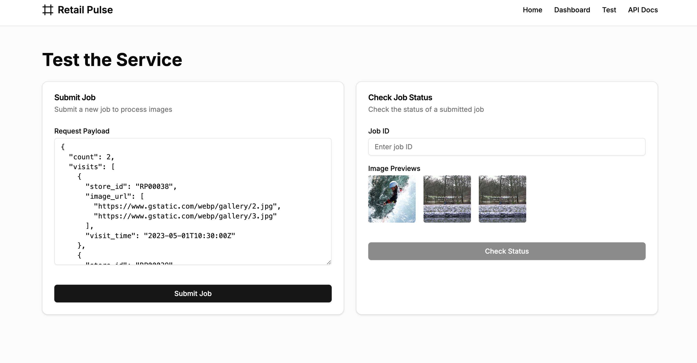
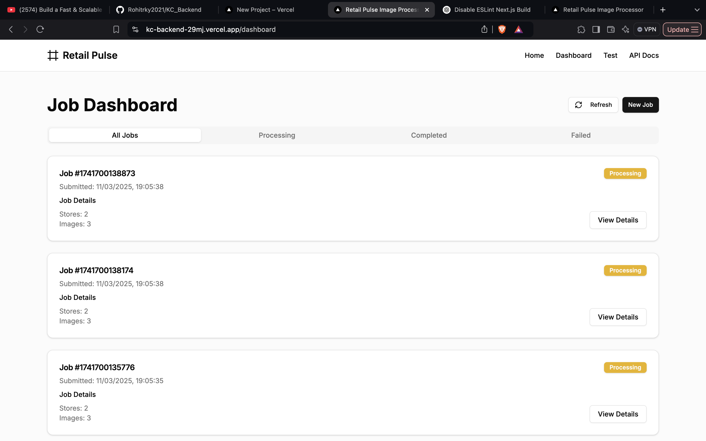
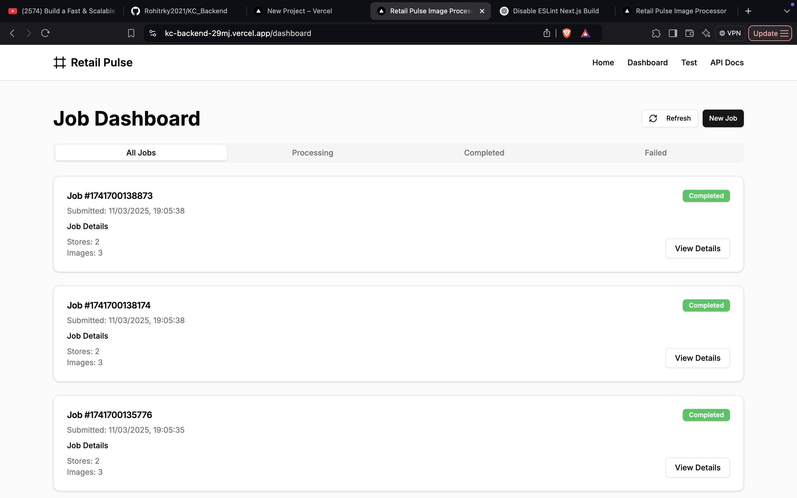

# Retail Pulse Image Processing Service


A high-performance service for processing retail store images at scale. This application calculates image perimeters and simulates GPU processing time for thousands of images collected from retail stores.





## 📋 Table of Contents

- [Features](#features)
- [Tech Stack](#tech-stack)
- [Getting Started](#getting-started)
  - [Prerequisites](#prerequisites)
  - [Installation](#installation)
  - [Running Locally](#running-locally)
  - [Docker Setup](#docker-setup)
- [API Documentation](#api-documentation)
  - [Submit Job](#submit-job)
  - [Check Job Status](#check-job-status)
- [Project Structure](#project-structure)
- [Usage Examples](#usage-examples)
- [Deployment](#deployment)
- [Future Improvements](#future-improvements)

## ✨ Features

- **Bulk Image Processing**: Handle thousands of images in a single job
- **Concurrent Processing**: Process multiple jobs simultaneously
- **Store Validation**: Validate store IDs against master data
- **Perimeter Calculation**: Calculate image perimeters (2 \* [Height + Width])
- **GPU Simulation**: Simulate GPU processing time
- **Asynchronous Processing**: Non-blocking job execution
- **Real-time Status Updates**: Check job status in real-time
- **Error Handling**: Comprehensive error reporting

## 🛠️ Tech Stack

- **Framework**: [Next.js](https://nextjs.org/) (App Router)
- **Language**: [TypeScript](https://www.typescriptlang.org/)
- **Styling**: [Tailwind CSS](https://tailwindcss.com/)
- **UI Components**: [shadcn/ui](https://ui.shadcn.com/)
- **Image Processing**: [Sharp](https://sharp.pixelplumbing.com/)
- **Containerization**: [Docker](https://www.docker.com/)

## 🚀 Getting Started

### Prerequisites

- Node.js 18.x or higher
- npm or yarn

### Installation

1. Clone the repository:

   ```bash
   git clone https://github.com/your-username/retail-pulse-image-processor.git
   cd retail-pulse-image-processor
   ```

2. Install dependencies:
   ```bash
   npm install
   # or
   yarn install
   ```

### Running Locally

1. Start the development server:

   ```bash
   npm run dev
   # or
   yarn dev
   ```

2. Open [http://localhost:3000](http://localhost:3000) in your browser.

### Docker Setup

1. Build the Docker image:

   ```bash
   docker build -t retail-pulse-image-processor .
   ```

2. Run the container:
   ```bash
   docker run -p 3000:3000 retail-pulse-image-processor
   ```

## 📚 API Documentation

### Submit Job

Create a job to process images collected from stores.

- **Endpoint**: `POST /api/submit`
- **Content-Type**: `application/json`

**Request Payload**:

```json
{
  "count": 2,
  "visits": [
    {
      "store_id": "RP00038",
      "image_url": [
        "https://www.gstatic.com/webp/gallery/2.jpg",
        "https://www.gstatic.com/webp/gallery/3.jpg"
      ],
      "visit_time": "2023-05-01T10:30:00Z"
    },
    {
      "store_id": "RP00039",
      "image_url": ["https://www.gstatic.com/webp/gallery/3.jpg"],
      "visit_time": "2023-05-01T11:45:00Z"
    }
  ]
}
```

**Success Response (201 CREATED)**:

```json
{
  "job_id": "1683456789123"
}
```

**Error Response (400 BAD REQUEST)**:

```json
{
  "error": "Invalid request format"
}
```

### Check Job Status

Check the status of a submitted job.

- **Endpoint**: `GET /api/status?jobid=1683456789123`

**Success Response - Completed (200 OK)**:

```json
{
  "status": "completed",
  "job_id": "1683456789123"
}
```

**Success Response - Failed (200 OK)**:

```json
{
  "status": "failed",
  "job_id": "1683456789123",
  "error": [
    {
      "store_id": "S00339218",
      "error": "Store ID does not exist"
    }
  ]
}
```

**Error Response (400 BAD REQUEST)**:

```json
{}
```

## 📁 Project Structure

```plaintext
retail-pulse-image-processor/
├── app/                      # Next.js App Router
│   ├── api/                  # API routes
│   │   ├── status/           # Job status endpoint
│   │   └── submit/           # Job submission endpoint
│   ├── api-docs/             # API documentation page
│   ├── test/                 # Test interface
│   └── page.tsx              # Home page
├── components/               # UI components (shadcn/ui)
├── lib/                      # Core functionality
│   ├── image-processor.ts    # Image processing logic
│   ├── job-processor.ts      # Job processing logic
│   ├── job-store.ts          # In-memory job storage
│   └── store-validator.ts    # Store ID validation
├── public/                   # Static assets
├── Dockerfile                # Docker configuration
└── README.md                 # Project documentation
```

## 🔍 Usage Examples

### Testing the Service

1. Navigate to the [Test Page](http://localhost:3000/test)
2. Submit a job with the provided sample payload
3. Use the generated job ID to check the status
4. View the response in the output section

### Programmatic Usage

```typescript
// Submit a job
const submitJob = async () => {
  const response = await fetch("http://localhost:3000/api/submit", {
    method: "POST",
    headers: {
      "Content-Type": "application/json",
    },
    body: JSON.stringify({
      count: 1,
      visits: [
        {
          store_id: "RP00038",
          image_url: ["https://www.gstatic.com/webp/gallery/2.jpg"],
          visit_time: new Date().toISOString(),
        },
      ],
    }),
  });

  const data = await response.json();
  console.log("Job ID:", data.job_id);
  return data.job_id;
};

// Check job status
const checkStatus = async (jobId) => {
  const response = await fetch(
    `http://localhost:3000/api/status?jobid=${jobId}`
  );
  const data = await response.json();
  console.log("Job Status:", data.status);
  return data;
};
```

## 🌐 Deployment

### Vercel Deployment

This project is optimized for deployment on Vercel:

1. Push your code to a GitHub repository
2. Import the repository in Vercel
3. Deploy with default settings

### Custom Server Deployment

For custom server deployment, use the provided Dockerfile:

1. Build the Docker image
2. Push to your container registry
3. Deploy to your server or cloud provider

## 🔮 Future Improvements

- **Database Integration**: Replace in-memory storage with a persistent database
- **Authentication**: Add API authentication for secure access
- **Rate Limiting**: Implement rate limiting to prevent abuse
- **Webhooks**: Add webhook support for job completion notifications
- **Advanced Image Processing**: Add more image analysis features
- **Monitoring**: Add metrics and monitoring
- **Caching**: Implement caching for frequently accessed images
- **Horizontal Scaling**: Support for distributed processing across multiple nodes
